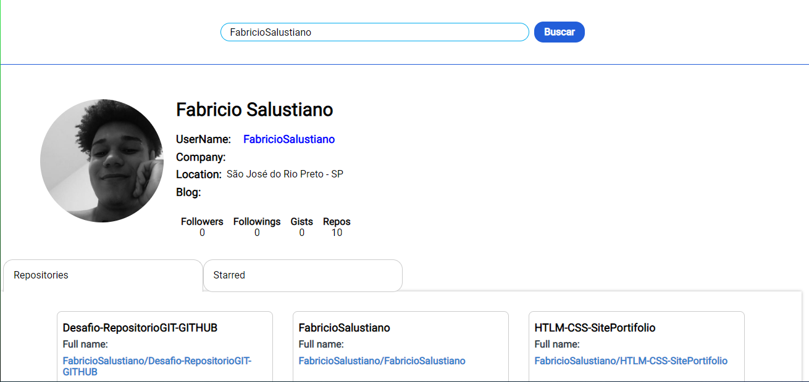

# GitHub Perfil
Este é um projeto para trabalho de conclusão dos estudos referente a biblioteca React e suas ferramentas.
Tive como objetivo criar um site que implementasse APIs do GitHub nos retornando informações para construção de um perfil. No projeto conseguimos ver algumas informações do usuario pesquisado e logo a baixo uma tabela contendo seus repositorios e suas Starreds.

## Ferramentas
- Styled components
- React Context
- React Hooks
- React Tabs
- Axios 

## Tela do APP
